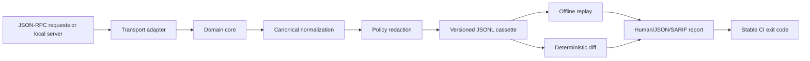

# Cassetta Architecture Contract

## Purpose

Cassetta is a local-first evidence boundary for JSON-RPC tool workflows. It captures a bounded session, transforms it into a versioned and redacted cassette, and provides offline replay and deterministic comparison. The runtime core must remain provider-neutral, network-free, and independent from the browser product surface.

## Product boundaries

Cassetta owns **session evidence**, not execution policy. It may launch a user-supplied local process for capture because that is the user’s explicit command, but it never executes a cassette during replay and never makes outbound network calls as part of the core or offline commands.

Cassetta is not an MCP Inspector, hosted observability platform, LLM evaluator, sandbox, secret manager, or complete protocol conformance suite. Those systems may be used alongside it.

## Architecture



The repository retains a TypeScript ESM monorepo with three bounded packages:

| Package               | Responsibility                                                                           | Must not do                                          |
| --------------------- | ---------------------------------------------------------------------------------------- | ---------------------------------------------------- |
| `@cassetta/core`      | Types, canonicalization, redaction, JSONL serialization, cassette validation, diff model | Spawn processes, access network, print CLI output    |
| `@cassetta/transport` | Local process lifetime, JSONL framing, capture, replay orchestration ports               | Define business policy or persist secrets unredacted |
| `@cassetta/cli`       | Argument parsing, filesystem boundaries, reports, exit codes                             | Contain normalization or transport logic inline      |

## Public cassette contract

The first format remains version `1`. The header is one JSON object followed by one entry per line:

```json
{"cassette":"baseline","version":1,"createdAt":"<volatile-time>"}
{"sequence":1,"direction":"request","timestamp":"<volatile-time>","message":{"jsonrpc":"2.0","id":"<volatile-id>","method":"tools/list","params":{}}}
{"sequence":2,"direction":"response","timestamp":"<volatile-time>","latencyMs":12,"message":{"jsonrpc":"2.0","id":"<volatile-id>","result":{}}}
```

The following invariants are stable and testable:

| Invariant   | Contract                                                                                                             |
| ----------- | -------------------------------------------------------------------------------------------------------------------- |
| Version     | Unknown versions are rejected rather than guessed.                                                                   |
| Sequence    | Entries are strictly 1-based and contiguous.                                                                         |
| Direction   | Capture pairs request/response; notifications are valid only when explicitly represented.                            |
| Ordering    | Object keys are canonicalized before comparison; array ordering is preserved because it may be behavioral.           |
| Volatility  | Only documented fields such as timestamps and string IDs are normalized by default.                                  |
| Redaction   | Key and value policies run before persistence; redaction is visible as a replacement marker, never silently omitted. |
| Replay      | Replay requires the same request count and normalized request sequence; mismatches identify sequence and path.       |
| Persistence | JSONL is UTF-8, newline-terminated, inspectable, and deterministic apart from header creation metadata.              |

## CLI contract

| Command                                                 | Purpose                                                          |      Success |                                   Meaningful failure |
| ------------------------------------------------------- | ---------------------------------------------------------------- | -----------: | ---------------------------------------------------: |
| `record <input> <output>`                               | Normalize and redact an existing cassette                        |          `0` |                           `2` for invalid input/path |
| `capture-stdio <requests> <output> <command> [...args]` | Capture a bounded local JSONL process                            |          `0` |                `2` for spawn/framing/timeout failure |
| `replay <cassette> [requests.json]`                     | Replay cassette offline, optionally validating supplied requests |          `0` | `1` for behavioral mismatch; `2` for malformed input |
| `diff <expected> <actual>`                              | Emit deterministic cassette differences                          | `0` if equal |            `1` if differences; `2` for invalid input |
| `check <cassette>`                                      | Validate schema, sequence, and pair structure                    |          `0` |                             `2` for invalid cassette |

Human-readable output is for developers; `--json` is stable machine output. The CLI must resolve input paths predictably and reject unsafe path handling where it would escape the intended working directory or overwrite an input unexpectedly.

## Error taxonomy

| Code/class               | Meaning                                                 | Recovery                                              |
| ------------------------ | ------------------------------------------------------- | ----------------------------------------------------- |
| `CassetteFormatError`    | Invalid header, JSONL, sequence, or unsupported version | Fix or regenerate the cassette; no partial success.   |
| `RedactionPolicyError`   | Invalid user redaction pattern or replacement           | Correct the policy before capture.                    |
| `TransportSpawnError`    | Process could not start or exited before response       | Verify executable, arguments, and permissions.        |
| `TransportTimeoutError`  | Bounded response deadline exceeded                      | Inspect server deadlock or increase explicit timeout. |
| `TransportProtocolError` | Output was not one JSON message per line                | Fix framing or use a compatible adapter.              |
| `ReplayMismatchError`    | Supplied request differs from recorded behavior         | Inspect diff; update cassette only intentionally.     |
| `CliUsageError`          | Missing or invalid command arguments                    | Show concise usage and return code `2`.               |

## Engineering contract

| Area            | Target                                                                                                                                            |
| --------------- | ------------------------------------------------------------------------------------------------------------------------------------------------- |
| Reliability     | Offline commands are deterministic; capture always terminates child processes in success and failure paths.                                       |
| Performance     | Offline validation and replay are linear in cassette entries; no dependency on a database or network.                                             |
| Security        | Redact before write, avoid shell interpolation, bound process lifetime, do not execute cassette content, and never log raw secrets intentionally. |
| Compatibility   | Node.js 20+ for the package; TypeScript ESM; cassette versioning allows additive fields without breaking readers.                                 |
| Maintainability | Domain functions stay focused; transport and CLI remain thin; public contracts are tested as executable specifications.                           |
| Distribution    | `pnpm build:cli`, local tarball installation, and a documented `cassetta` binary.                                                                 |

## Failure matrix

| Failure                         | Detect                     | Handle                                           | Recover                                    | Report                            |
| ------------------------------- | -------------------------- | ------------------------------------------------ | ------------------------------------------ | --------------------------------- |
| Invalid JSON request            | Parse at CLI boundary      | Reject before spawn                              | Correct fixture                            | File and line context             |
| Empty request list              | Validate before spawn      | Return usage error                               | Add request                                | Stable error code                 |
| Spawn failure                   | Child process error event  | Stop capture                                     | Fix command/permissions                    | Executable and cause              |
| Timeout                         | Per-response timer         | Kill child and fail closed                       | Increase explicit timeout or fix server    | Pair and timeout duration         |
| Invalid stdout JSON             | JSON parse boundary        | Stop session and kill child                      | Fix server framing                         | Response line context             |
| Unexpected process exit         | Exit event before response | Fail capture                                     | Fix server lifecycle                       | Exit status                       |
| Malformed cassette              | Header/entry validation    | Reject without replay                            | Regenerate or edit safely                  | Sequence/line                     |
| Replay mismatch                 | Canonical comparison       | Return non-zero without execution                | Review diff/update baseline intentionally  | Pair and path                     |
| Secret-like data                | Key/value policy           | Replace before persistence                       | Add project policy; use synthetic fixtures | Redaction count without raw value |
| Large input/resource exhaustion | Size and line bounds       | Fail before unbounded allocation where practical | Split cassette or raise explicit limit     | Limit and observed size           |

## Threat model

### Assets

The primary assets are source-adjacent tool arguments and responses, credentials embedded in payloads, local process access, cassette integrity, and reviewer trust in the gate result.

### Attack surface and trust boundaries

| Boundary              | Threat                                                  | Mitigation                                                                                      |
| --------------------- | ------------------------------------------------------- | ----------------------------------------------------------------------------------------------- |
| User CLI → filesystem | Path traversal, accidental overwrite, symlink surprises | Resolve paths, validate input/output distinction, document permissions, add tests.              |
| CLI → child process   | Command injection or unbounded process behavior         | Pass executable and argv separately to `spawn`; no shell; timeout and cleanup.                  |
| Child stdout → parser | Malformed JSON, huge lines, instruction-like content    | Treat as untrusted data; parse only; bound reads where feasible; never execute payload text.    |
| Payload → cassette    | Credential or private-data leakage                      | Default key/value redaction, explicit warnings, synthetic fixtures, negative tests.             |
| Cassette → replay     | Cassette interpreted as instructions                    | Replay only compares data and returns recorded JSON; no process/network execution.              |
| Diff output → CI logs | Secret echo or terminal control sequences               | Redact before comparison/reporting and serialize JSON safely.                                   |
| Dependencies → build  | Supply-chain compromise                                 | Lockfile, minimal dependencies, audit in CI, dependency review, no runtime network requirement. |

## Verification gates

The implementation is not releasable until formatting, type checking, focused unit tests, transport integration tests, CLI smoke tests, documentation examples, dependency audit, and a clean-install path pass. The final audit must explicitly label each claim as **VERIFIED**, **PARTIALLY VERIFIED**, or **NOT VERIFIED**.
