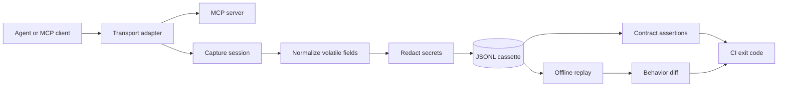

# Implementation Plan: Cassetta

## Overview
Cassetta is a local-first, provider-neutral contract-testing and deterministic replay toolkit for MCP JSON-RPC workflows. The first release combines a domain core, a JSONL cassette format, a CLI surface, and a polished static product page that makes the workflow understandable without external credentials.

## Architecture Decisions

| Decision | Rationale |
|---|---|
| TypeScript ESM monorepo shape | Matches the protocol ecosystem and keeps the domain core reusable by CLI, tests, and future adapters. |
| Pure domain core with explicit ports | Recording, replay, redaction, normalization, and contract evaluation remain testable without a live server or network. |
| JSONL cassette format | Streamable, diffable in Git, easy to inspect, and suitable for incremental writes. |
| Deterministic normalization before comparison | Removes volatile IDs, timestamps, and ordering noise while preserving meaningful behavior changes. |
| Policy-driven redaction | Prevents secrets from entering committed artifacts and allows project-specific patterns without coupling to a provider. |
| Exit-code based CLI | Makes the tool useful in CI and local scripts without a dashboard dependency. |
| Static product UI in the webdev scaffold | Provides an immediately reviewable product surface while keeping the executable core independent from browser/server code. |

## Domain flow

## MVP acceptance criteria

| Area | Done when |
|---|---|
| Core model | Requests, responses, timing, metadata, and assertions have typed representations. |
| Cassette | A cassette can be written, read, normalized, redacted, and compared deterministically. |
| CLI | `record`, `replay`, `diff`, and `check` have useful help, stable exit codes, and JSON/text output. |
| Security | Default redaction covers common secret keys and bearer tokens; path handling rejects traversal. |
| Tests | Unit, integration, failure, and regression tests exercise the domain and CLI paths. |
| Docs | README, architecture, protocol, configuration, contributing, security, and changelog exist. |
| CI | GitHub Actions runs formatting, type checking, tests, coverage, and dependency audit. |
| Product surface | Landing page explains the problem, workflow, artifact format, CI usage, and roadmap. |

## Risks and mitigations

| Risk | Impact | Mitigation |
|---|---|---|
| MCP protocol changes | High | Keep transport adapter behind an interface; test against fixture envelopes. |
| Accidental secret capture | High | Redact before persistence, add negative tests, and fail closed for unsafe paths. |
| False-positive diffs | Medium | Normalize only documented volatile fields and expose the transformation in reports. |
| Overbuilding a dashboard | Medium | Keep MVP CLI/core-first; UI is documentation and workflow visualization, not the runtime. |
| Name collision | Low | Use Cassetta as a product name and verify repository search before creation. |

## Phases

### Phase 1: Core domain and cassette format
Implement types, normalization, redaction, JSONL persistence, and deterministic diffing.

### Phase 2: CLI and fixtures
Add commands, sample fixture server/client messages, human-readable reports, and machine-readable output.

### Phase 3: Open Source foundation
Add license, contributor policy, security policy, code of conduct, changelog, docs, issue templates, and CI.

### Phase 4: Product surface
Replace the scaffold home page with the Signal Archive landing experience and ensure the visual surface accurately reflects the executable workflow.

### Phase 5: Verification and publication
Run checks in a clean install, build, tests, coverage, audit, Docker smoke test where available, then create and push the GitHub repository.
